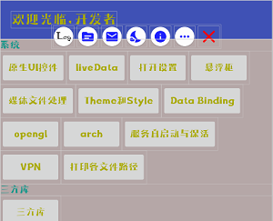
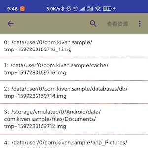
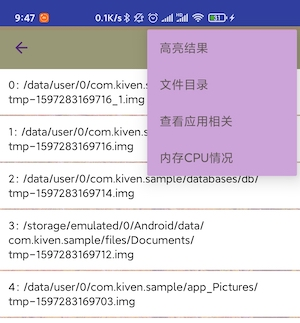
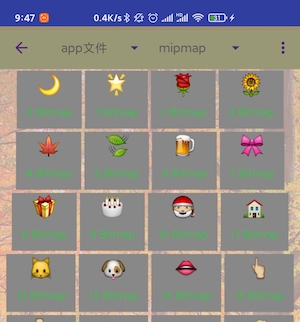
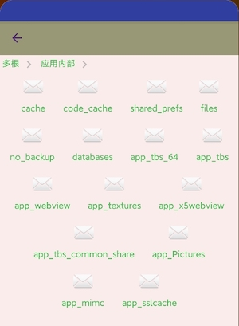

# KUtils
一些工具集合。
- Activity代理。继承`KActivityHelper`，只需要在`manifest`中注册一次`KHelperActivity`就行，免去多人协作同时修改`manifest`导致`git`冲突的情况。
- 输出带代码位置的日志，并且在手机上可查看日志，且仅在`debug`状态打印，打包`release`好不会打印。
- 在手机端查看mipmap/drawable/color资源
- 在手机上查看当前app目录结构
- 各种功能、三方库的使用demo
- 小米、华为、OPPO、vivo 4大厂商的推送集成

### KActivityHelper 使用方法
- 注意区分`KHelperActivity`与`KActivityHelper`的区别

- anifest注册`KHelperActivity`
```
<activity android:name="com.kiven.kutils.activityHelper.KHelperActivity" />
```

- 使用`KActivityHelper`
```
// 实现
public class AHShare extends KActivityHelper {
    @Override
    public void onCreate(KHelperActivity activity, Bundle savedInstanceState) {
        super.onCreate(activity, savedInstanceState);
        setContentView(R.layout.activity_h_test_base);
    }
}
// 调用
AHShare().startActivity(mActivity)
AHShare().startActivityForResult(mActivity, 8899)
```
`注`: KActivityHelper 是 Activity 的代理，通过mActivity持有Activity。通过代码可以看出，KActivityHelper在Activity之前创建， KActivityHelper.startActivity时会请KActivityHelper存入静态map，存入时拿取到key，将key存入intent后其他Activity。Activity启动后在onCreate中，通过key从静态map拿取到KActivityHelper，开始将Activity的生命周期与KActivityHelper绑定，在onDestroy()释放KActivityHelper与Activity的相互持有。

`内存回收`: 这种情况，KActivityHelper是不能拿取到了，所以只有重新创建KActivityHelper，可查看KHelperActivity类里面的方法getHelper(Bundle savedInstanceState)理解原理，其实就是通过反射实现的，内存回收的时候会在onSaveInstanceState()保存类名。所以，建议不要直接给KActivityHelper设置参数值，还是通过KActivityHelper.getIntent()来设置值。

### 查看打印的日志
- Activity继承`KActivity`, 不用对`KActivityHelper`进行处理
```
public class ConfigureWidget extends KActivity {
    @Override
    protected void onCreate(@Nullable Bundle savedInstanceState) {
        super.onCreate(savedInstanceState);
        setContentView(R.layout.activity_h_test_base);
    }
}
```
- 输出日志需要使用指定的方法来输出
```
KLog.i("Hello KLog.);
KLog.d("Hello KLog.);
KLog.e("Hello KLog.);
KLog.w("Hello KLog.);
```
- 运行App，摇动手机或者长按顶部呼吸条(仔细看，在界面顶部有呼吸条)，出现功能弹窗，选择Log进入日志查看界面

  
- 自定义日志弹窗
```
DebugView.addAction("测试", new DebugViewListener() {
    @Override
    public void onClick(Activity activity, View view, DebugEntity entity) {
        new AHTest().startActivity(activity);
    }
});
```
### 在手机端查看mipmap/drawable/color资源
- 打开日志界面，点击`查看资源`。
- 注意：在`查看资源`界面，可以点击右边按钮选择`查看日志`进入日志查看界面

  
### app目录结构
- 打开日志界面，按右上角的按钮选择`文件目录`

  
### 各种功能、三方库的使用demo
- 运行sample模块可启动demo